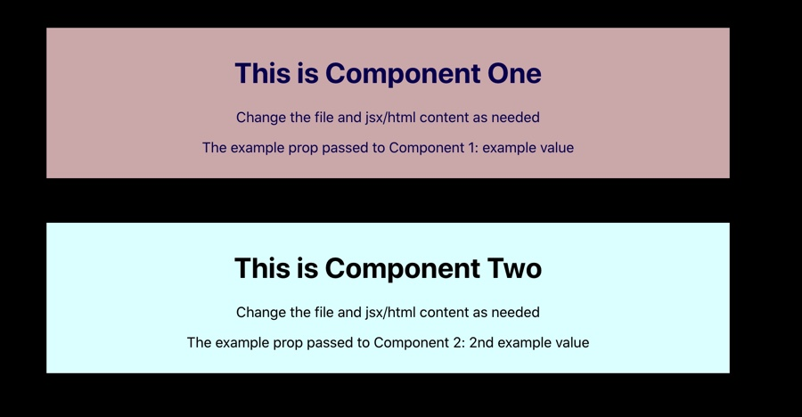
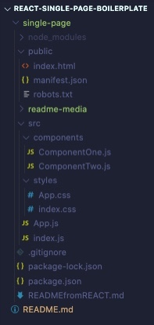

# React-Single-Page-Boilerplate
### *by Collin Didier* 
#### Date: 10/17/2020

This repository is a template for quickly creating/initializing React applications with an organized file structure and common content.

### Repo file structure and content:

### Core Technologies: 
  

    
    
    
    
    
    
  

### Dependencies: 
Node.js 
Git, for cloning (a standalone package with source code is not yet made)
A package manager such as npm, yarn, etc.

### How to get started: 
Note: Necessary terminal commands may vary depending on your package manager. Below instructions use npm.
Note: This repository is packaged as a pre-built React application, requiring intitialization with the below steps.

1. **Fork this repository to your github account and clone that fork to your machine** OR download/extract the source code from a release (available soon)
2. In your main project directory run the terminal command **>npm install** 
3. If you receive a message about deprecated or vulnerable files, enter terminal command **>npm audit fix**
4. Launch the application with terminal command **>npm start**
